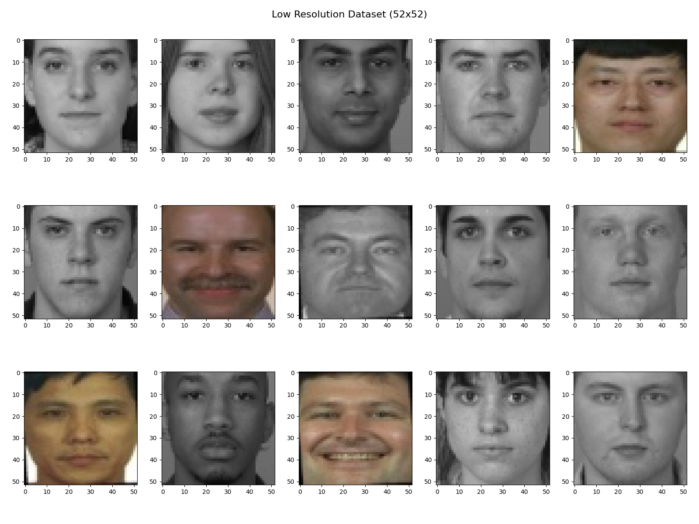

# Evaluating Face Recognition Systems on Datasets Generated by Single Image Super-Resolution techniques

The repo represents training and testing of Face Recognition Systems on low quality face images before and after the application of different open-source single image super resolution methods Super-resolution is the process of recovering a high-resolution (HR) image from a low-resolution (LR) image. In the recent past different researchers demonstrated the feasibility of creating high quality face images from low quality face images, in particular by using deep learning. It is of interest whether these methods enable the application of face recognition in unconstrained
scenarios where only low quality images are available.

# Environment Setup

Before try running the code, we would need to install the some packages mentioned in the requirements.txt. We can simply run the following command while in the project direcotory.

    pip install -r requirements.txt

Download facenet_weights.h5 from the link below and place them in the weights directory.

https://drive.google.com/uc?id=1971Xk5RwedbudGgTIrGAL4F7Aifu7id1

## Regenerating Our Own High-Resolution Images [Optional]
If we want to regenerate our own dataset from low-resolution images, we would first need to clone super-resolution repo from [here](https://github.com/krasserm/super-resolution), install their requirements. Then copy scripts from scripts/super-resolution folder into super-resolution root directory. There are three different techniques used in the repo; EDSR, WDSR and SRGAN. Regenerate high-resolution images by running the repective scripts. Do not forget to first download pre-trained weights from their repo and extract them in the root directory.

# Datasets
We have used [FERET Dataset](https://www.nist.gov/itl/products-and-services/color-feret-database) for training and evaluation of our FR System. Instead of using the whole dataset, we have taken a subset of the dataset with `359` classes each having all images from the front view. The first `200` classes contains `7` samples each while the remaining 159 classes contains `5` samples at least making a total of `2176` images. Images are both RGB and grey-scaled.

The images were first passed through Face Detector and cropped face images were generated and resized to resolution of `80x80`. For the face detection, we have used [RetinaFace](https://sefiks.com/2021/04/27/deep-face-detection-with-retinaface-in-python/) from [deepface](https://github.com/serengil/deepface) library. The first dataset was named as *FERET_80x80* dataset and is considered to be the original one. The original dataset can be downloaded from the link below:

https://drive.google.com/file/d/1Q88lU4wnFbYQaIcm_6BzPTN3RreB4Sp7/view?usp=sharing

Some samples are given below:

The FERET_80x80 dataset was regenerated with resolution of `52x52` and was named *FERET_52x52_lr* (Low Resolution).

Using techniques from [Single Image Super-Resolution with EDSR, WDSR and SRGAN](https://github.com/krasserm/super-resolution), we generated three more datasets using our low resolution dataset. The new dataset generated were then resized to `80x80` to match the original dataset resolution. Upto this point, we have total of 5 datasets, an original one, low res dataset and three high res regenerated datasets using super-resolution techniques.

# Face Recognition System
We have used [deepface](https://github.com/serengil/deepface) library for face recognition perposes. Deepface is a lightweight face recognition framework for python. It is a hybrid face recognition framework wrapping state-of-the-art models: VGG-Face, Google FaceNet, OpenFace, Facebook DeepFace, DeepID, ArcFace and Dlib. Those models already reached and passed the human level accuracy. 

Out of those models, we have used [Google Facenet](https://arxiv.org/abs/1503.03832) model with InceptionResNetV1 architecture which accepts a cropped face RGB image of size `160x160` whereas it produces 128-dimensional representations Auto-encoded representations called embeddings in the research paper.

Each Dataset from the previous section were split into train and test sets. Training set contained a total of 1740 samples whether the testing set contained 436 samples. For each sample in the training set, face embeddings were predicted and saved in an array called X. The final shape of X was `(1740, 128)`. Another numpy array with shape `(128, )` was generated which contained the labels as integers representing differnt classes.

Finally, a Support Vector Classifier was trained on the training data. The classifier was hyper-tuned using hyper parameters and K-folds Cross Validation. The training accuracy for each dataset were found to be above 90 percent.

# Benchmark
Each Dataset from the previous section were evaluated using trained model on the test set of 436 samples. Below is the summary of the results:

| Dataset              	| Image Resolution 	| Test Samples 	| Correctly Classified 	| Miss Classified 	| Accuracy Score 	|
|----------------------	|------------	|--------------	|----------------------	|-----------------	|----------------	|
| FERET_80x80          	| 80x80      	| 436          	| 378                  	| 58              	| 86.69%         	|
| FERET_52x52_lr       	| 52x52      	| 436          	| 311                  	| 125             	| 71.33%         	|
| FERET_80x80_SRGAN_hr 	| 80x80      	| 436          	| 335                  	| 101             	| 76.82%         	|
| FERET_80x80_WDSR_hr  	| 80x80      	| 436          	| 369                  	| 67              	| 84.63%         	|
| FERET_80x80_EDSR_hr  	| 80x80      	| 436          	| 372                  	| 64              	| 85.32%         	|

# Scripts Description

There are a few scrips with specific functions. 

- **dataset.py:** process FERET dataset by first detecting faces in images and then crops them. The cropped faces are then fed into facenet model to extract face embeddings. This script saves the cropped faces in jpg format, saves the face embeddings and their labels in .npz file which is accessible using numpy in Python. The purpose of this script is to generate embeddings which will then be used for training different classifiers.

- **generate_low_res_images.py:** simply resize images into low-resolution images and save them keeping the direcotry structure the same.

- **generate_results.py:** This script trains an SVC classifier on a dataset and saves the trained classifier. It also evaluate a classifier on test dataset. A datasete is split into train/test in a ratio of 9:1.
